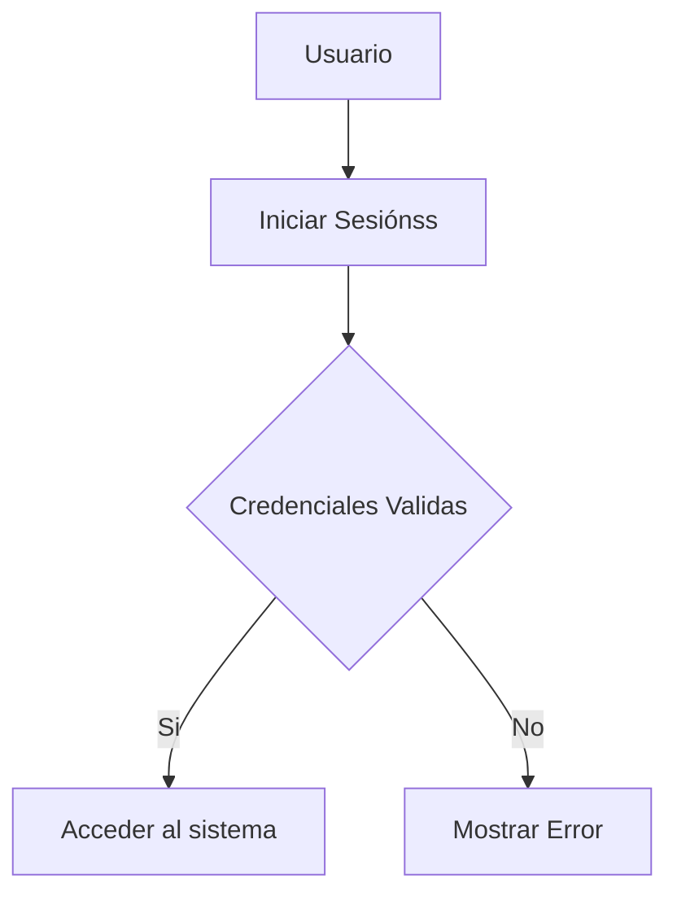

# Sistema de Matricula

## Descripcion
Sistema para registrar alumnos en diferentes cursos.

## Tecnologias
| Tecnologia de Uso | Aprendiendo |
|-------------------|-------------|
| Java | Backend |
| Mysql | Base de datos |

| Tecnología | Uso |
|------------|-----|
| Java | Backend |
| MySQL | Base de datos |

## Funciones
- [x] Registro de Alumno
- [x] Generar Matricula
- [ ] Generar Reportes

## Aprendiendo Mermaid

## Aprendiendo mas
